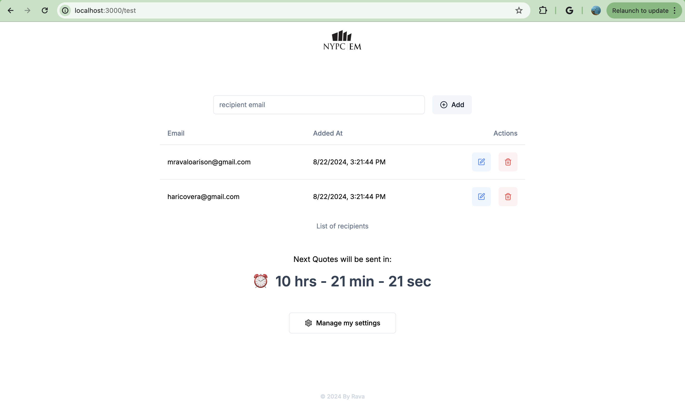
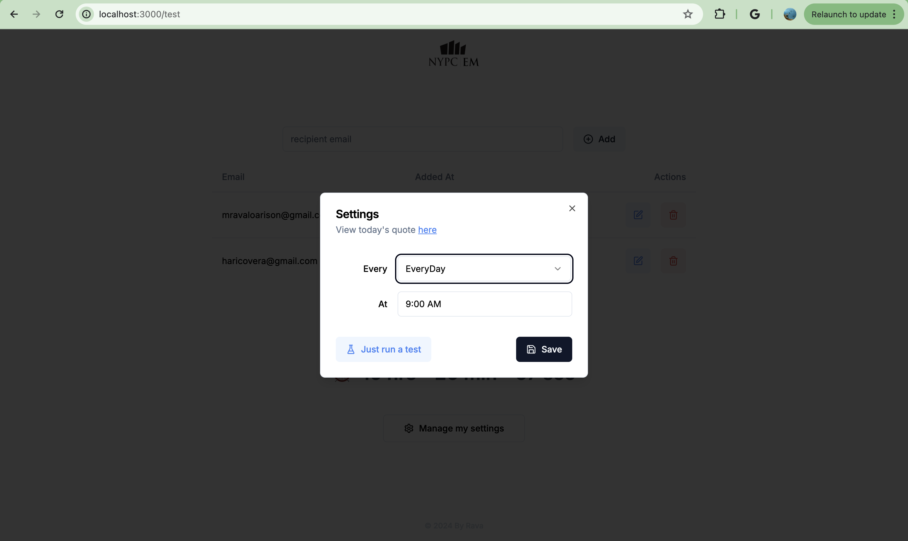
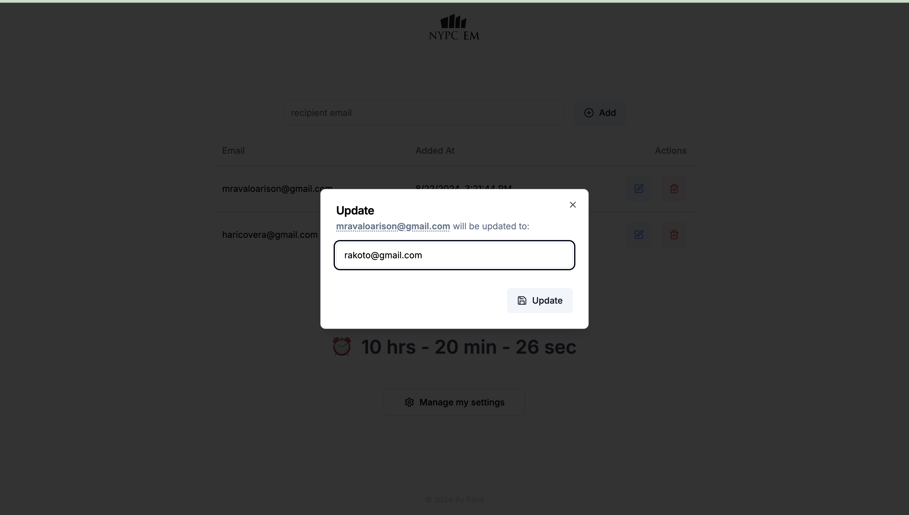
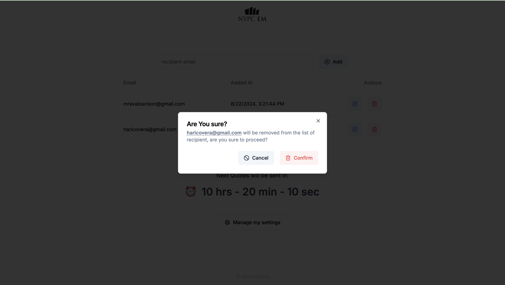
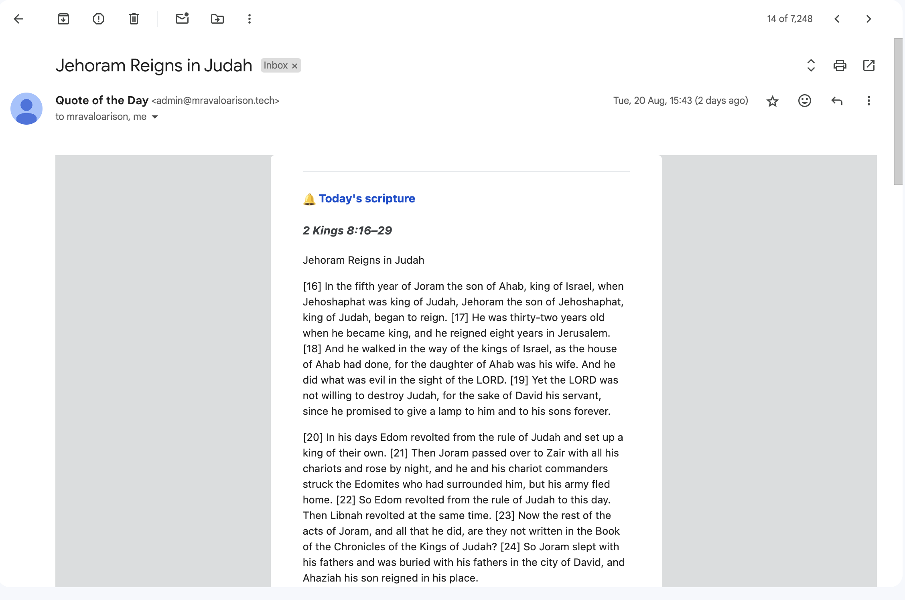

[👁️ Live Demo](https://main.dr80uwsjpr41h.amplifyapp.com/)

# Automated email sending

This app was originally a Python app that sends automated email to users. The issue was in needed to be run manually. Now that it is a web app, it can be run on a server and send emails automatically from there.

# What it does

-   Scrape daily QT passage from [Living life](https://www.duranno.com/livinglife/qt/) website
-   Uses [ESV API](https://api.esv.org/docs/) to get the according Bible verse
-   Automate sending the verse and QT passage to designated users's email

# Screenshots

